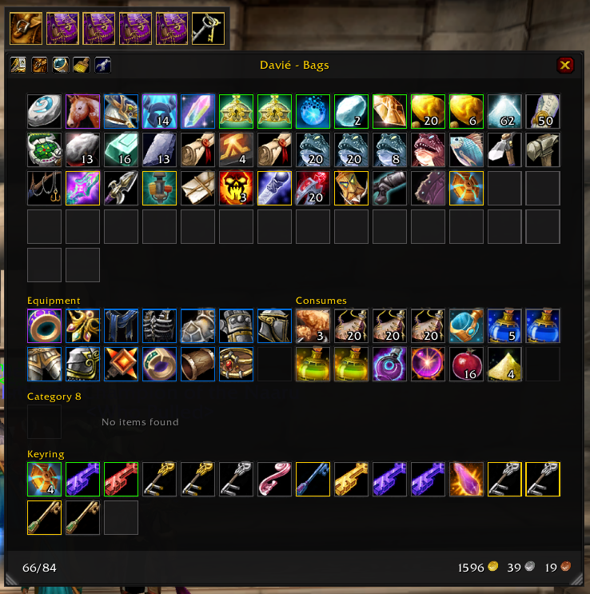

# LunaBags

LunaBags is a World of Warcraft Classic inventory addon that replaces the default bag and bank views with a single-window layout, sorting, per-character cached item views, category sections, and tooltip item counts.

[](https://www.patreon.com/wuild)




## Install

1. Copy this `LunaBags` folder into your WoW Classic addons directory:

   ```text
   World of Warcraft/_classic_era_/Interface/AddOns/LunaBags
   ```

   For PTR or other installs, use that client's matching `Interface/AddOns` folder.

2. Make sure the folder contains `LunaBags.toc` directly inside it. The path should look like:

   ```text
   Interface/AddOns/LunaBags/LunaBags.toc
   ```

3. Restart the game, or run `/reload` if the addon was already present.

4. On the character select screen, open **AddOns** and enable **LunaBags**.

## Basic Use

- Press `B` or use `/lb open` to open the bag window.
- Visit a banker to open the bank window.
- Drag the top bar to move a window.
- Use the wrench button in the title bar, or run `/lb`, to open LunaBags settings.
- Use the magnifying glass to show or hide search.
- Use the backpack button to show or hide the bag rail.
- The bottom status bar shows used slots, such as `38/40`, on the left and money on the right.

Bag and bank item buttons keep Blizzard's normal item behavior, so clicking, using, dragging, splitting, and bank movement should work like the default UI.

## Slash Commands

- `/lb` or `/lunabags` opens settings.
- `/lb open`, `/lb close`, `/lb toggle` controls the bag window.
- `/lb view Name-Realm` shows cached bags for another character.
- `/lb view current` returns to the current character.
- `/lb scan` forces a character cache scan.
- `/lb debug` toggles debug display.
- `/lb enable` and `/lb disable` toggle the addon.
- `/lb window` opens the extra style/test window.

## Configure The UI

Open `/lb`, then use:

- **UI > Appearance** for shared bag and bank colors, opacity, item frame color, border size, stack-count text size, and cooldown text size.
- **UI > Bags** for bag window width, max height, item size, spacing, frame scale, lock position, and split rows.
- **UI > Bank** for bank window width, max height, item size, spacing, frame scale, lock position, and reset position.
- **Plugins** for quality borders and trash item markers.
- **Profiles** for AceDB profile switching, copying, and resets.

Some settings are per character, including split bag sections and locked sort slots.

## Sorting

Click the broom icon to sort. Right-click the broom in the bag window for lock-slot tools.

Sorting settings live in `/lb` under **Sorting**:

- **Reverse Slot Order** places the first sorted items at the bottom-right end of the bag order.
- **Priority Item IDs** is a comma-separated list matched by the Priority sort rule. By default this includes the hearthstone item ID `6948`.
- **Sort Rules** are evaluated in order. Move rules up or down to change priority.
- Each rule can be enabled, removed, and set to ascending or descending.

Default rules prioritize priority items, then quality, item level, class ordering, item class/subclass, equipment location, name, item ID, and stack count.

Sorting respects:

- User-locked slots.
- Temporary item locks while the client is moving items.
- Specialty bag compatibility, such as ammo or quiver bags.
- Specialty bags first, then normal bag slots.

## Locked Slots

Right-click the bag broom icon and enable **Lock Slots Mode**. While lock mode is active, click a slot overlay to toggle whether sorting may move that slot. Locked slots show a red cross only while lock mode is active.

Use **Clear Locked Slots** from the same right-click menu to remove all locked slots for the current character.

## Categories

Categories create named sections inside the bag or bank window. They are configured in `/lb` under **Categories**.
Category settings are profile-scoped and per character.

1. Choose **Category Scope**:
   - **Bags** for inventory categories.
   - **Bank** for bank categories.
2. Enable **Category Sections**.
3. Click **Add Category**.
4. Name the category and configure its rules.
5. Move categories up or down to control priority.

Category matching details:

- Categories are checked from top to bottom.
- The first matching category wins.
- Rules inside one category are combined with AND logic. For example, choosing an armor class and a quality range means an item must satisfy both conditions.
- A category with no rules does not match anything.

Supported category rules:

- **Item IDs**: comma-separated item IDs.
- **Quality**: enable the quality rule, then set minimum and maximum quality.
- **Item Classes**: match broad item classes.
- **Item Subclasses**: available after choosing item classes.
- **Equip Locations**: comma-separated equip location tokens, such as `INVTYPE_HEAD` or `INVTYPE_TRINKET`.
- **Equipment Set Items**: matches items from Blizzard Equipment Manager, ItemRack, or Outfitter when those APIs/addons are available.
- **Minimum Slots**: reserves visible empty slots in a category section.
- **Category Columns**: controls the default side-by-side category density.
- **Section Columns**: overrides how many item columns an individual category section uses.

Items that do not match a category remain in the normal uncategorized flow.

## Character View And Cache

LunaBags stores per-character bag, bank, money, and item-count cache data in `LunaBagsDB`.

- Use the character button in the bag title bar to switch views.
- Non-current character views are read-only.
- Cached bank data updates when the bank is available.
- Tooltip item-count lines are added after Blizzard sets the tooltip, so they should remain visible after tooltip refreshes.

## Development Notes

- Main addon startup and defaults: `LunaBags.lua`.
- Addon file loader: `LunaBags.xml`.
- Default saved-variable config: `core/configs.lua`.
- Shared addon helpers: `core/methods.lua`.
- Blizzard frame integration: `core/blizzard.lua`.
- Slash commands: `core/commands.lua`.
- Runtime event handlers: `core/events.lua`.
- Blizzard bag hooks: `core/hooks.lua`.
- Sorting engine: `core/sort.lua`.
- Category matching: `core/categories.lua`.
- Built-in plugins: `plugins/*.lua`.
- Persistent character cache: `data/bags.lua`.
- Bag UI: `ui/onebag.lua` and `ui/onebag.xml`.
- Bank UI: `ui/onebank.lua` and `ui/onebank.xml`.
- Options UI: `core/settings.lua`.

After editing Lua/XML files, run `/reload` in game. Saved settings are stored in the account SavedVariables file for `LunaBagsDB`.
